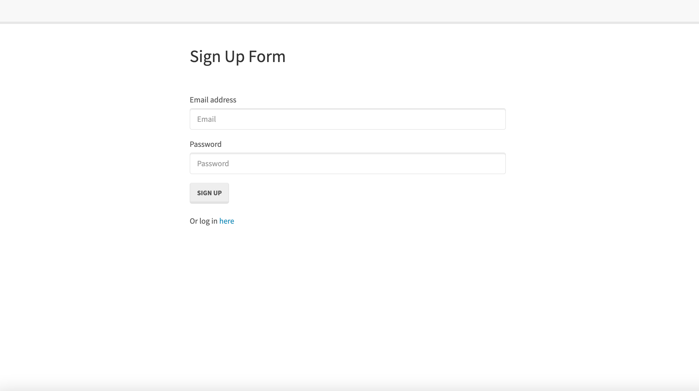
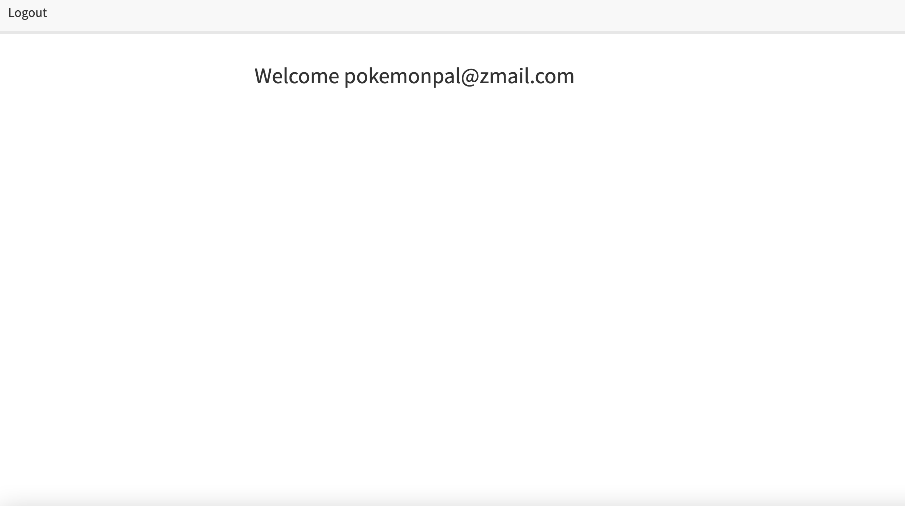

# User-Authentification

Welcome to User Authentification! Here I will give you a deeper understanding of how a full-stack application is put together and operates, starting with user creation, authentification, and login. Cheers!

## Project Details

Welcome to the user login application!

If you want to learn how to create a secure user login and authentification, this is the place to the start. Using various technologies, a database, server, and more, you can create a simple login feature to meet your needs. The possibilities are endless.

Thanks for stopping in!

## Application

User Authentification:

## Build Details

This application was developed using: MySql, Node.js, Passport, Express, Bcrypt, Sequelize, JavaScript, HTML, CSS, and more!

## Repository & Preview

View the repository at: https://github.com/MichaelWitt/User-Authentification

Preview: 
Demo: 

## Updates

You can find project updates in the repository, highlighting what was done to create the final product.

https://github.com/MichaelWitt/User-Authentification/commits/

## Credits

UNC Coding Bootcamp And Trilogy for the inspiration.

Thanks!

## Thanks For Visiting!

Come back soon :)
